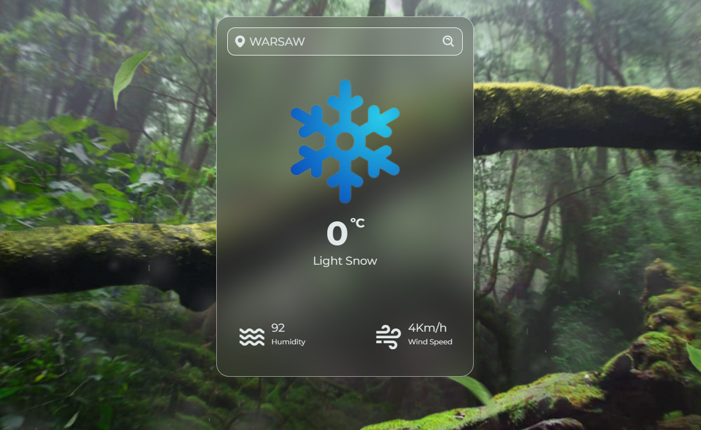

<h1 align="center" id="title">🌤️🌨️ Weather App 🌤️🌨️</h1>

The Weather app is a simple project where I practiced my JavaScript skills. It is built on top of a beginner-friendly technology stack. Try my simple application just enter your location and check the weather where you are. Also you can try amaizing parallax effect on website. 

  
  
<h2>💻 Built with</h2>

Technologies used in the project:

*   HTML
*   CSS
*   JS
*   Fetch

